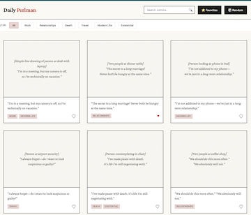

# Daily Perlman

A comic gallery web app built with React + TypeScript, Vite, React-Router, and Tailwind CSS.

The app lets you browse comics, filter and search them, view full details, and save favorites locally.

This project was built strictly as a personal project with no intention of commercial use. Just a fan of Asher Perlman comics!

## Features

- Browse comics in a responsive gallery.
- Filter comics by tags.
- Search comics by caption from the header search box.
- View comic detail pages with previous/next/random navigation.
- Save and remove favorites using local storage.
- Sort favorites by most recent, most viewed, or alphabetical.

## Tech Stack

- React 19
- TypeScript
- Vite
- React Router
- Tailwind CSS v4

## Demo

[](https://youtu.be/WboOE1usbvw)

### Prerequisites

- Node.js 20+ (or current LTS)
- npm

### Install

```bash
npm install
```

### Run in development

```bash
npm run dev
```

Then open the local URL shown in your terminal (usually `http://localhost:5173`).

## Data

- Comic data is loaded from `src/data/comics-data.json`.
- Favorites are persisted in `localStorage` under:
  - `favorites` (array of comic ids)
  - `lastAdded` (ISO date string)
